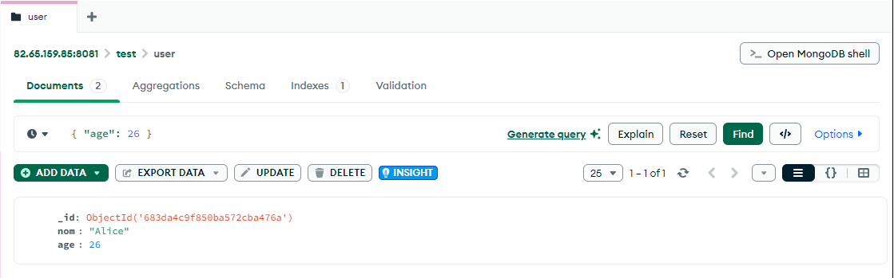

# Installation et Utilisation de MongoSH et Compass

## 1. Installation de MongoSH

### Windows
Téléchargez la dernière version de MongoSH depuis le site officiel :

[https://www.mongodb.com/try/download/shell](https://www.mongodb.com/try/download/shell)

Ou installez MongoSH globalement avec npm :

```bash
npm install -g mongosh
```

---

## 2. Lancer MongoSH et utiliser une base de données

### Sélectionner ou créer la base `test`

```
use test
```

Cette commande sélectionne la base `test`. Si elle n'existe pas, elle sera automatiquement créée lors de l'insertion d'un premier document.

---

## 3. Opérations de base avec MongoSH

### Créer une collection `user` et insérer un document

```
db.user.insertOne({ nom: "Alice", age: 25 })
```

Cette commande crée la collection `user` si elle n'existe pas encore, puis y insère un document.

---

### Supprimer un document

```
db.user.deleteOne({ nom: "Alice" })
```

Supprime le premier document correspondant au filtre `{ nom: "Alice" }`.

---

### Supprimer une collection

```
db.user.drop()
```

Supprime entièrement la collection `user` de la base de données.

---

### Mettre à jour un document

```
db.user.updateOne(
  { nom: "Alice" },
  { $set: { age: 26 } }
)
```

Met à jour le champ `age` du premier document correspondant au filtre `{ nom: "Alice" }`.

---

## Remarques complémentaires

- Les commandes MongoSH sont sensibles à la casse.
- L'utilisation de `insertOne`, `deleteOne`, `updateOne`, et `drop` permet de gérer finement les documents et collections.
- Les commandes présentées ici s'exécutent depuis le shell `mongosh`, une interface interactive en ligne de commande pour MongoDB.

## 4. Installation de MongoDB Compass
Téléchargez MongoDB Compass depuis le site officiel :
[https://www.mongodb.com/try/download/compass](https://www.mongodb.com/try/download/compass)
Installez Compass en suivant les instructions pour votre système d'exploitation.
## 5. Utilisation de MongoDB Compass
### Connexion à une base de données
Ouvrez MongoDB Compass et entrez l'URI de connexion pour votre base de données MongoDB. Par exemple :


### Navigation dans les collections
Une fois connecté, vous pouvez naviguer dans les collections de votre base de données. Compass affiche une interface graphique pour visualiser les documents, exécuter des requêtes et gérer les index.
### Exécution de requêtes

Utilisez la barre de requêtes pour exécuter des requêtes MongoDB. Par exemple, pour trouver tous les utilisateurs qui ont 26 ans :

```json
{ "age": 26 }
```


### Ajouter un document


### Supprimer un document


### Ajouter et supprimer une collection

Pour ajouter une collection : 

Pour supprimer une collection, cliquez sur l'icône de la corbeille à côté du nom de la collection dans la liste des collections :

